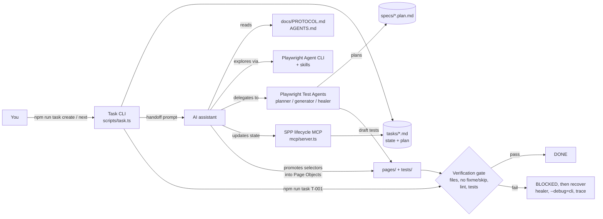

# ai-ts-playwright-protocol

Smart Playwright Protocol (SPP): a file-backed workflow for writing Playwright tests in TypeScript with an AI assistant, where every task passes the same verification gate before it counts as done.

[](https://github.com/yashwant-das/ai-ts-playwright-protocol/actions/workflows/verify.yml)
[](LICENSE)
[](https://playwright.dev)
[](https://www.typescriptlang.org)

## Why it exists

Playwright now ships its own agents: a token-efficient browser CLI, agent skills, and planner, generator and healer subagents. They write tests quickly, but the result is hard to review: there is no record of what was asked, generated tests put selectors inline, and a healer can quietly mark a test `fixme`. SPP wraps those agents in a contract. Each piece of work is a task file with a fixed lifecycle; agents explore, plan, generate and heal inside it; and a task only moves to `DONE` when the verification gate passes: selectors in Page Objects, lint clean, tests green, nothing skipped. The protocol, not the agent, decides when work is finished.

## Architecture



The task CLI hands a task to the assistant. The assistant explores with the Playwright CLI, has the planner write a test plan and the generator draft the test, then promotes every selector into a Page Object. The same CLI runs the gate that decides the task's final state, and the healer helps recover when it fails.

Every task follows one workflow:

```text
Select → Understand → Explore → Plan → Implement → Promote → Verify
                                                              ├─ PASS → DONE
                                                              └─ FAIL → BLOCKED → Recover → Verify
```

## Quickstart

Prerequisites: Node.js 20 or later (see `.nvmrc`), and an AI assistant: Claude Code, VS Code / GitHub Copilot, Codex and OpenCode get ready-made Playwright Test Agents.

```bash
git clone https://github.com/yashwant-das/ai-ts-playwright-protocol.git && cd ai-ts-playwright-protocol
npm install
npx playwright install
cp .env.example .env     # BASE_URL defaults to https://www.saucedemo.com
npm test
```

A green run lists the specs in `tests/` (including the two seed tests) passing against Sauce Demo. To work through a task with an assistant:

```bash
npm run task create      # interactive wizard, writes tasks/T-XXX_*.md
npm run task next        # moves a task to IN_PROGRESS and copies the handoff prompt
# paste the prompt into your assistant; it follows docs/PROTOCOL.md
npm run task T-001       # runs the verification gate for that task
```

The Playwright agents, skills and MCP configuration are committed, so they work out of the box. After upgrading Playwright, run `npm run agents` to regenerate them. Per-assistant setup notes are in [docs/CLI.md](docs/CLI.md#playwright-agent-tooling).

## Test reports and results

- Tests run **locally only**: `npm test` for the suite, `npm run task <TASK_ID>` for one task's gate. SPP work is driven by an AI assistant on your machine, so CI does not install browsers or run tests.
- CI runs the static checks on every push and pull request to `main`: lint (ESLint and markdownlint) and `npx playwright test --list`, which confirms every spec, fixture and Page Object loads.
- `npx playwright show-report` opens the last local run's HTML report.

The tests run against the public Sauce Demo site, so each failing test is retried once and a trace is kept for the retry.

## Tech stack

| Layer | Tool | Version | Why |
| --- | --- | --- | --- |
| Test runner | Playwright Test | 1.63 | Auto-waiting locators, traces and an HTML report out of the box |
| Agent tooling | Playwright Agent CLI, Test Agents, skills | 1.63 (bundled) | Token-efficient exploration, planning, generation and healing |
| Language | TypeScript | 5.3 | Typed page objects and task schemas |
| Task CLI | ts-node, @clack/prompts | 10.9, 1.5 | Interactive task creation and state changes |
| Assistant tooling | Model Context Protocol SDK | 1.29 | Exposes the task lifecycle to the assistant |
| Schema validation | zod | 4.4 | Validates MCP tool inputs |
| Quality gates | ESLint, markdownlint, Husky, lint-staged | 9, 0.49, 9, 17 | Same checks locally and in CI |

## Project structure

```text
├── docs/            # PROTOCOL.md (source of truth), CLI.md, ROADMAP.md
├── tasks/           # One Markdown file per task, with state and context
├── specs/           # Test plans (planner output), linked from tasks
├── pages/           # Page objects, including Components/
├── tests/           # Playwright specs, fixtures.ts and seed tests
├── scripts/         # Task CLI, verification gate, agent regeneration, selector checker
├── mcp/             # SPP lifecycle MCP server
├── types/           # Task types
├── .claude/ .github/agents/ .codex/ .opencode/ .agents/
│                    # Generated Playwright agents and skills (npm run agents)
├── AGENTS.md        # Short instructions for AI assistants (CLAUDE.md imports it)
└── playwright.config.ts
```

## Documentation

- [docs/PROTOCOL.md](docs/PROTOCOL.md): workflow, states and rules
- [docs/CLI.md](docs/CLI.md): command reference, agent and MCP setup, troubleshooting
- [docs/ROADMAP.md](docs/ROADMAP.md): planned improvements
- [AGENTS.md](AGENTS.md): instructions for AI assistants

## License

MIT. See [LICENSE](LICENSE).
