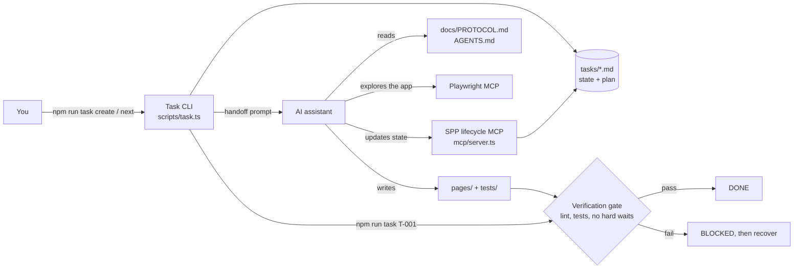

# ai-ts-playwright-protocol

Smart Playwright Protocol (SPP): a file-backed workflow for writing Playwright tests in TypeScript with an AI assistant, where every task passes the same verification gate before it counts as done.

[](https://github.com/yashwant-das/ai-ts-playwright-protocol/actions/workflows/verify.yml)
[](https://github.com/yashwant-das/ai-ts-playwright-protocol/actions/workflows/verify.yml)
[](LICENSE)
[](https://playwright.dev)
[](https://www.typescriptlang.org)

## Why it exists

AI assistants write Playwright tests quickly, but the result is hard to review: there is no record of what was asked, what the assistant explored, or whether the test was ever run. SPP turns each piece of automation work into a task file with a fixed lifecycle, and a task only moves to `DONE` when lint and the tests pass and no focused tests or hard waits remain. The protocol, not the assistant, decides when work is finished.

## Architecture



The task CLI hands a task to the assistant; the assistant explores the app through Playwright MCP, writes page objects and tests, and the same CLI runs the gate that decides the task's final state.

Every task follows one workflow:

```text
Select → Understand → Explore → Plan → Implement → Verify
                                                    ├─ PASS → DONE
                                                    └─ FAIL → BLOCKED → Recover → Verify
```

## Quickstart

Prerequisites: Node.js 20 (see `.nvmrc`), and an AI assistant with MCP support for the handoff steps.

```bash
git clone https://github.com/yashwant-das/ai-ts-playwright-protocol.git && cd ai-ts-playwright-protocol
npm install
npx playwright install
cp .env.example .env     # BASE_URL defaults to https://www.saucedemo.com
npm test
```

A green run lists the specs in `tests/` passing against Sauce Demo. To work through a task with an assistant:

```bash
npm run task create      # interactive wizard, writes tasks/T-XXX_*.md
npm run task next        # moves a task to IN_PROGRESS and copies the handoff prompt
# paste the prompt into your assistant; it follows docs/PROTOCOL.md
npm run task T-001       # runs the verification gate for that task
```

MCP server setup (Playwright MCP and the optional SPP lifecycle server) is in [docs/CLI.md](docs/CLI.md#configure-mcp-servers).

## Test reports and results

- CI runs lint (ESLint and markdownlint) and the Playwright suite on every push and pull request to `main`.
- The Playwright HTML report from each run is attached to the run as the `playwright-report` artifact: open the [latest Verify run](https://github.com/yashwant-das/ai-ts-playwright-protocol/actions/workflows/verify.yml) and download it.
- Locally, `npx playwright show-report` opens the last run's report.

The tests run against the public Sauce Demo site, so CI retries each test up to twice.

## Tech stack

| Layer | Tool | Version | Why |
| --- | --- | --- | --- |
| Test runner | Playwright Test | 1.60 | Auto-waiting locators, traces and an HTML report out of the box |
| Language | TypeScript | 5.3 | Typed page objects and task schemas |
| Task CLI | ts-node, @clack/prompts | 10.9, 1.5 | Interactive task creation and state changes |
| Assistant tooling | Model Context Protocol SDK | 1.29 | Exposes the task lifecycle to the assistant |
| Schema validation | zod | 4.4 | Validates MCP tool inputs |
| Quality gates | ESLint, markdownlint, Husky, lint-staged | 9, 0.49, 9, 17 | Same checks locally and in CI |

## Project structure

```text
├── docs/            # PROTOCOL.md (source of truth), CLI.md, ROADMAP.md
├── tasks/           # One Markdown file per task, with state and plan
├── pages/           # Page objects, including Components/
├── tests/           # Playwright specs
├── scripts/         # Task CLI and the pre-commit selector checker
├── mcp/             # SPP lifecycle MCP server
├── types/           # Task types
├── AGENTS.md        # Short instructions for AI assistants
└── playwright.config.ts
```

## Documentation

- [docs/PROTOCOL.md](docs/PROTOCOL.md): workflow, states and rules
- [docs/CLI.md](docs/CLI.md): command reference, MCP setup and troubleshooting
- [docs/ROADMAP.md](docs/ROADMAP.md): planned improvements
- [AGENTS.md](AGENTS.md): instructions for AI assistants

## License

MIT. See [LICENSE](LICENSE).
